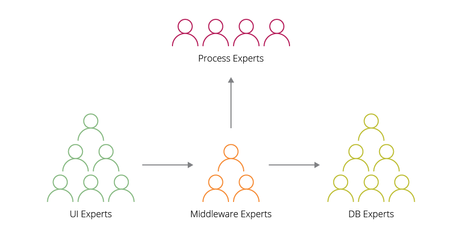
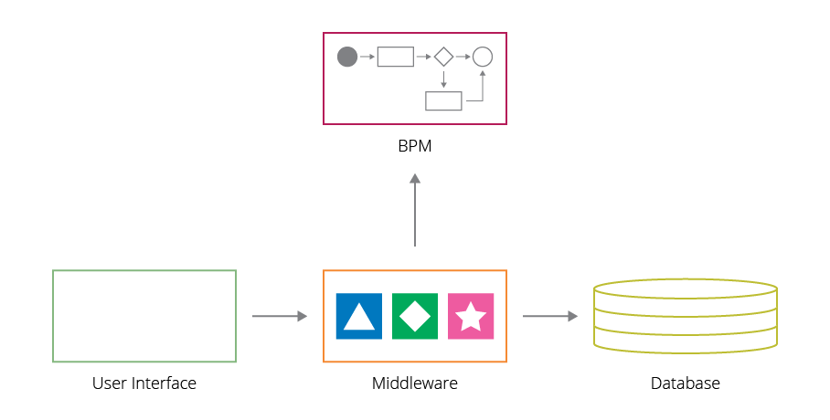
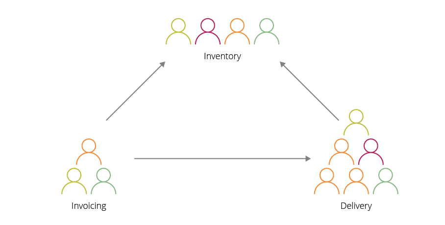
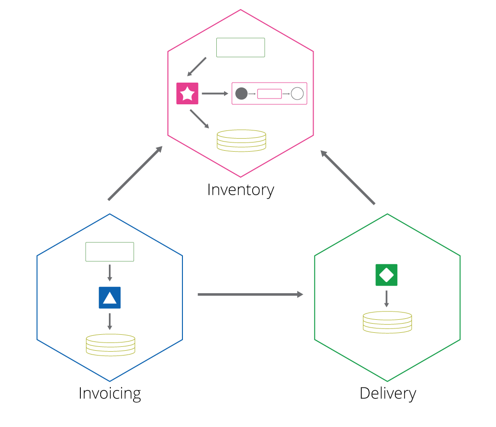
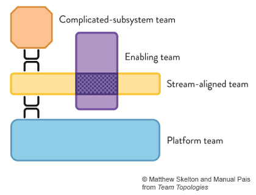
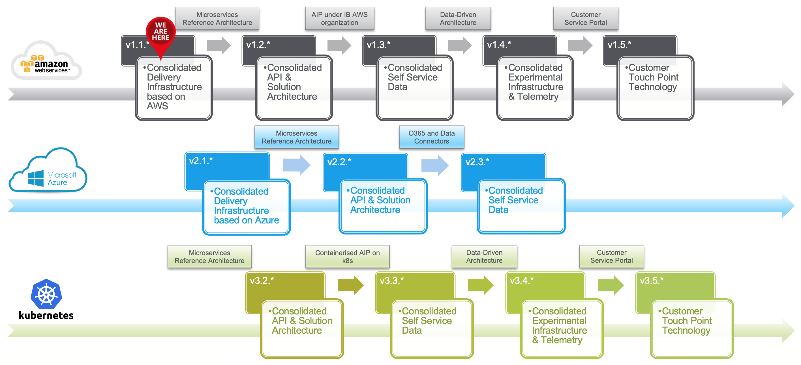

# <!--fit--> Software Development in the 21st century

David Parra

https://github.com/dparra0007/dparra0007.github.io

<!-- This is presenter note. You can write down notes through HTML comment. -->

---

## **Conway's law**

*“organizations which design systems . . . are constrained to produce designs which are copies of the communication structures of these organizations"*

## **Inverse Conway maneuver**

*"organizations should evolve their team and organizational structure to achieve the desired architecture."*

---

#### Diseñar los sistemas y los equipos alrededor de los dominios y unidades de negocio.
###### Evitar los diseños con fronteras tecnologicas, que actualmente existen en *Resibernet, .NET, Angular, ...* por ejemplo.

---

---

---

##### Diseñar sistemas que minimicen componentes *"complicated-subsystem"* y *"enabling"*, y los equipos vinculados a ellos.

###### Esos componentes existen actualmente. Por ejemplo: *BELK, WCS, Mashery, ...*

---

## **Low coupling, high cohesion**

Coupling: degree of interdependence between software modules.
Cohesion: components that are self-contained,  independent, and with a single, well-defined purpose.

---

#### Diferenciar claramente entre Framework, sistema de librerias y plataforma:
    - Los frameworks imponen homegenidad pero acoplan.
    - Las librerias no imponen la reusabilidad, pero reducen el acoplamiento.
    - Las plataformas promueven la reusabilidad de componentes "core" al tiempo
    que permiten un desacople máximo de implementaciones.
###### Usar frameworks dentro de subdominios muy acoptados y estáticos. Librerias en dominios con requerimientos exigentes de rendimiento. Y plataformas de forma extendida a la organización.

---

IBIS es un midleware diseñado e fundamentado en un "custom" framework con un problema estructural de muy alto acoplamiento, basado en modulos centrales sin posibilidad de evolución.

###### Hay que desacoplar IBIS organizandolo en subdominios, y evolucionarlos a diferente ritmo en función de sus diferentes necesidades. 

---

## **Evolutionary Architecture**

The software development ecosystem is constantly changing, with a constant stream of innovation in tools, frameworks and techniques.

---

- Tenemos que conseguir modularidad y desacoplamiento a través de APIs. Poder desplegarlas independientemente de otras APIs.
- Estas APIs tienen que estar construidas alrededor de capaciades de negocio.
- Tiene que ser posible probar y experimentar facilmente estas APIs sin requerir entornos de integración, y poder reemplazarlas de forma gradual.

---

### Lo conseguimos a través de una estandarización mínima y sencilla

- Comunicaciones
    - Protocolos de red,
    - Formatos de datos,
    - [Interfaces, esquemas y especificaciones](https://gitlab.com/david-parra/iag/gbs/it/architecture/technical-architecture/software-engineering/api-standards).
- Despliegues
    - [Gestión de código fuente](https://gitlab.com/david-parra/iag/gbs/it/architecture/technical-architecture/software-engineering/release-management),
    - [Gestión de configuraciones](https://gitlab.com/david-parra/iag/gbs/it/architecture/technical-architecture/software-engineering/release-management),
    - [Monitorización, alertas, depuración](https://gitlab.com/david-parra/iag/gbs/it/architecture/technical-architecture/software-engineering/event-management).

---

#### Y una plataforma digital que irá evolucionando

---

## **Open source development model**

The software development ecosystem is constantly changing, with a constant stream of innovation in tools, frameworks and techniques.

