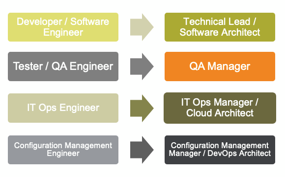

# <!--fit--> Software Development in the 21st century

David Parra

https://github.com/dparra0007/dparra0007.github.io

<!-- This is presenter note. You can write down notes through HTML comment. -->

---

## **Conway's law**

*“organizations which design systems . . . are constrained to produce designs which are copies of the communication structures of these organizations"*

## **Inverse Conway maneuver**

*"organizations should evolve their team and organizational structure to achieve the desired architecture."*

---

#### Diseñar los sistemas y los equipos alrededor de los dominios y unidades de negocio.
###### Evitar los diseños con fronteras tecnologicas, que actualmente existen en *Resibernet, .NET, Angular, ...* por ejemplo.

---

---

---

##### Diseñar sistemas que minimicen componentes *"complicated-subsystem"* y *"enabling"*, y los equipos vinculados a ellos.

###### Esos componentes existen actualmente. Por ejemplo: *BELK, WCS, Mashery, ...*

---

##### El modelo de interacción entre componentes "*stream-aligned*", y con "*platform*", debe ser orientado a servicios, creando contratos claros que reduzcan ineficiencias en la comunicación.

###### La interacción se implementa a través de la definición de contratos que cumplen con especificaciones estandares: openAPI (Swagger), gRPC, tests de pactos (pact.io), BDD, ...

---

## **Low coupling, high cohesion**

Coupling: degree of interdependence between software modules.
Cohesion: components that are self-contained,  independent, and with a single, well-defined purpose.

---

#### Diferenciar claramente entre Framework, sistema de librerias y plataforma:
    - Los frameworks imponen homegenidad pero acoplan.
    - Las librerias no imponen la reusabilidad, pero reducen el acoplamiento.
    - Las plataformas promueven la reusabilidad de componentes "core" al tiempo
    que permiten un desacople máximo de implementaciones.
###### Usar frameworks dentro de subdominios muy acoptados y estáticos. Librerias en dominios con requerimientos exigentes de rendimiento. Y plataformas de forma extendida a la organización.

---

#### Consideraciones importantes sobre Frameworks y repositorios de librerias

###### Usar Evitar los "custom" frameworks construidos a media dentro de una organizacion porque añaden complejidad técnica y costes de mantenimiento.

###### Protegerse del consumo directo de liberias de terceros a través de repositorios espejos dentro de la organización.

---

IBIS es un midleware diseñado e fundamentado en un "custom" framework con un problema estructural de muy alto acoplamiento, basado en modulos centrales sin posibilidad de evolución.

###### Hay que desacoplar IBIS organizandolo en subdominios, y evolucionarlos a diferente ritmo en función de sus diferentes necesidades. 

---

## **Evolutionary Architecture**

The software development ecosystem is constantly changing, with a constant stream of innovation in tools, frameworks and techniques.

---

### API-fication for internals as public

- Tenemos que conseguir modularidad y desacoplamiento a través de APIs. Poder desplegarlas independientemente de otras APIs.
- Estas APIs tienen que estar construidas alrededor de capaciades de negocio.
- Tiene que ser posible probar y experimentar facilmente estas APIs sin requerir entornos de integración, y poder reemplazarlas de forma gradual.

---

### Lo conseguimos a través de una estandarización mínima y sencilla

- Comunicaciones
    - Protocolos de red,
    - Formatos de datos,
    - [Interfaces, esquemas y especificaciones](https://gitlab.com/david-parra/iag/gbs/it/architecture/technical-architecture/software-engineering/api-standards).
- Despliegues
    - [Gestión de código fuente](https://gitlab.com/david-parra/iag/gbs/it/architecture/technical-architecture/software-engineering/release-management),
    - [Gestión de configuraciones](https://gitlab.com/david-parra/iag/gbs/it/architecture/technical-architecture/software-engineering/release-management),
    - [Monitorización, alertas, depuración](https://gitlab.com/david-parra/iag/gbs/it/architecture/technical-architecture/software-engineering/event-management).

---

#### Y una plataforma digital que irá evolucionando

---

## **Open source development model**

The software development ecosystem is constantly changing, with a constant stream of innovation in tools, frameworks and techniques.

---

#### Code never lies

###### Dentro de la organización, teniendo en cuenta casos excepcionales, el código fuente tiene que ser compartido para poder leerlo, revisarlo, hacer forks, contribuir de vuelta, ...

###### Todo en la organizacion tiene que ser definido por código: infraestructura, aplicaciones, configuraciones, politicas, documentación, ...

---

#### Roles

###### Alrededor del código de cada componente, se dibuja una estructura sencilla, dinámica y poco jerarquizada:

    - Owners: The person/s who has administrative ownership over the 
    organization or repository.
    - Mantainers: are the only people in a repository with commit access.
    - Contributor: who comments on an issue or pull request.
    - Commiter: People who use the application/service. They might be active 
    in conversations or express their opinion on the code repo’s direction.

---

#### Technical skills map & personal development

###### Los roles previos tienen que mapearse contra un mapa claro de competencias tecnicas definidas a través de habilidades, experiencia, certificaciones y meritos.

---

#### Codigo de conducta

###### Que claramente defina el tipo de cultura que queremos que inspire nuestra disciplina de ingeniería de software:

- Eficiencia
- Mejora continua
- Innovación

---

## **Roadmap**

Three mainstreams to work in during **this year**: platform enablement, decouple legacy systems and stablish an open source development model.

---

#### 1. Plataforma

###### 1.1. Implement these aspects of **dynamic infrastructure** over existing AWS cloud capabilities:

    - Security Assurance: Account Management, IDAM, Log Audit and 
    Policy Management.
    - Cost Control: Per organization, account and resource.
    - Asset Management: Log Management, Performance Monitoring and
    Service Catalog.
    - Naming & Tagging Strategy.

###### To enable these characteristics:

    - Programmable,
    - On-demand,
    - Self-service

---

#### 2. Decouple legacy systems

###### 2.1. Break artifical/technical dependencies between different functional components that IBIS middleware has been created.

###### 2.2. Deliver infrastructure and application templates with foundational architectures as an architecture sryles toolbox. (*Avoid custom frameworks, sharing libraries & frameworks, facilitate re-use through internal service consumption and repository forks*)

---

---

#### 3. Stablish Open Source Development Model

###### 3.1. Initial standarization through code for communication and deployment protocols and specifications. (use only mainstream industry standards).

###### 3.2. Model IT technical components and teams around *"stream-aligned"* teams, with tech leads, cloud and configuration managenent engineers.

###### 3.3. Evolve infraestructure and application architecture to *"platform"* teams.